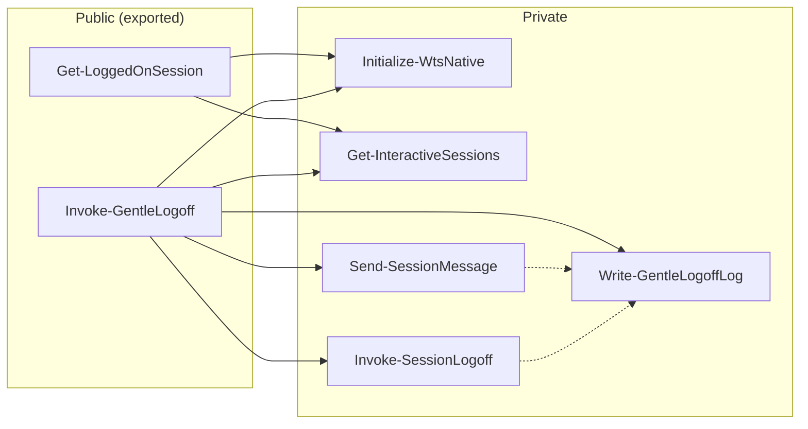

> **Disclaimer:** This code was written with the assistance of AI. It has not been exhaustively reviewed for every environment. Use it at your own risk.

# Gentle logoff before scheduled reboot

The **Logoff** PowerShell module enumerates interactive user sessions on a local Windows server, sends timed warning messages, and requests a graceful logoff before a maintenance reboot.

Only `Get-LoggedOnSession` and `Invoke-GentleLogoff` are exported. All other functions live under `src/Private/` and are not part of the public API.

## Module layout

```
src/
├── Logoff.psd1
├── Logoff.psm1
├── Public/
│   ├── Get-LoggedOnSession.ps1
│   └── Invoke-GentleLogoff.ps1
└── Private/
    ├── Get-InteractiveSessions.ps1
    ├── Initialize-WtsNative.ps1
    ├── Invoke-SessionLogoff.ps1
    ├── Send-SessionMessage.ps1
    └── Write-GentleLogoffLog.ps1
```

## Function call map

Arrows show direct calls from exported cmdlets to private helpers. Dashed arrows are private-to-private calls (not invoked from public functions).



Every private function is used by at least one exported cmdlet; there are no uncalled private helpers.

## Deploy the module

1. Copy the entire `src` folder to a permanent path on the server, for example:
   ```
   C:\Program Files\WindowsPowerShell\Modules\Logoff\
   ```
   or:
   ```
   C:\Scripts\Modules\Logoff\
   ```
2. Ensure only administrators can modify the module folder.

## Test before scheduling

Run an elevated PowerShell session on the server:

```powershell
Import-Module 'C:\Scripts\Modules\Logoff'

# List current sessions
Get-LoggedOnSession
Get-LoggedOnSession | Format-Table SessionId, DisplayUser, State, SessionName -AutoSize

# Dry run — lists sessions and planned actions, sends no messages
Invoke-GentleLogoff -WhatIf

# Live test with logging (use a short grace period in a test window)
Invoke-GentleLogoff -GracePeriodMinutes 5 -WarningMinutes 5,2,1 -LogPath C:\Logs\gentle-logoff.log
```

Return value:

| Result | Meaning |
|--------|---------|
| `$true` | All interactive users logged off |
| `$false` | One or more sessions still present after logoff |

For scheduled tasks, map the return value to an exit code:

```powershell
Import-Module 'C:\Scripts\Modules\Logoff'
if (-not (Invoke-GentleLogoff -GracePeriodMinutes 15 -WarningMinutes 15,5,1 -LogPath 'C:\Logs\gentle-logoff.log')) {
    exit 1
}
```

---

## Scheduled Task — Task Scheduler (GUI)

Create **two** tasks: one for gentle logoff, one for reboot. Stagger them so the reboot runs only after users have had time to log off.

Example timeline for a **02:00** reboot with a **15-minute** grace period:

| Task | Run at | Purpose |
|------|--------|---------|
| Gentle logoff | 01:45 | Warn users and log off sessions |
| Reboot | 02:00 | Restart the server |

### Task 1: Gentle logoff

1. Open **Task Scheduler** → **Create Task** (not “Create Basic Task”).
2. **General** tab:
   - Name: `Maintenance - Gentle logoff`
   - Description: `Warn and log off users before scheduled reboot`
   - Select **Run whether user is logged on or not**
   - Select **Run with highest privileges**
   - Configure for: **Windows Server 2016 / 2019 / 2022** (or your version)
3. **Triggers** tab → **New**:
   - Begin the task: **On a schedule**
   - Settings: **Daily** (or **Weekly**), set the maintenance time **minus** `GracePeriodMinutes`
   - Enabled: checked
4. **Actions** tab → **New**:
   - Action: **Start a program**
   - Program/script:
     ```
     powershell.exe
     ```
   - Add arguments:
     ```
     -NoProfile -ExecutionPolicy Bypass -Command "Import-Module 'C:\Scripts\Modules\Logoff'; if (-not (Invoke-GentleLogoff -GracePeriodMinutes 15 -WarningMinutes 15,5,1 -LogPath 'C:\Logs\gentle-logoff.log')) { exit 1 }"
     ```
5. **Conditions** tab:
   - Uncheck **Start the task only if the computer is on AC power** (typical for servers).
6. **Settings** tab:
   - Check **Allow task to be run on demand**
   - Check **If the task fails, restart every**: `1 minute`, **Attempt to restart up to**: `3` times
   - **If the task is already running**: **Do not start a new instance**

### Task 2: Reboot

1. **Create Task** → name: `Maintenance - Reboot`
2. **General**: same as above (**Run whether user is logged on or not**, **highest privileges**).
3. **Triggers**: same schedule as the maintenance window (e.g. **02:00 daily**).
4. **Actions** → **New**:
   - Program/script:
     ```
     shutdown.exe
     ```
   - Add arguments:
     ```
     /r /t 60 /c "Scheduled maintenance reboot in 60 seconds."
     ```
   - The 60-second delay gives a final chance to abort (`shutdown /a`) if something went wrong.
5. **Settings**: same as the logoff task.

### Order on maintenance night

```
01:45  Gentle logoff task starts (15 min grace + logoff)
02:00  Reboot task starts (60 s countdown, then restart)
```

Adjust times so `logoff start + GracePeriodMinutes + ~1 min buffer` completes before the reboot trigger.

---

## Scheduled Task — PowerShell registration

Run in an elevated PowerShell session. Edit paths, times, and accounts as needed.

```powershell
$modulePath = 'C:\Scripts\Modules\Logoff'
$logPath    = 'C:\Logs\gentle-logoff.log'

$logoffCommand = @"
Import-Module '$modulePath'
if (-not (Invoke-GentleLogoff -GracePeriodMinutes 15 -WarningMinutes 15,5,1 -LogPath '$logPath')) { exit 1 }
"@

$logoffAction = New-ScheduledTaskAction `
    -Execute 'powershell.exe' `
    -Argument "-NoProfile -ExecutionPolicy Bypass -Command `"$logoffCommand`""

$rebootAction = New-ScheduledTaskAction `
    -Execute 'shutdown.exe' `
    -Argument '/r /t 60 /c "Scheduled maintenance reboot in 60 seconds."'

# Daily at 01:45 — logoff (15 min before 02:00 reboot)
$logoffTrigger = New-ScheduledTaskTrigger -Daily -At '01:45'

# Daily at 02:00 — reboot
$rebootTrigger = New-ScheduledTaskTrigger -Daily -At '02:00'

$settings = New-ScheduledTaskSettingsSet `
    -AllowStartIfOnBatteries `
    -DontStopIfGoingOnBatteries `
    -StartWhenAvailable `
    -MultipleInstances IgnoreNew

# Run as SYSTEM (built-in, no password required)
$principal = New-ScheduledTaskPrincipal -UserId 'SYSTEM' -LogonType ServiceAccount -RunLevel Highest

Register-ScheduledTask -TaskName 'Maintenance - Gentle logoff' `
    -Action $logoffAction -Trigger $logoffTrigger -Settings $settings -Principal $principal

Register-ScheduledTask -TaskName 'Maintenance - Reboot' `
    -Action $rebootAction -Trigger $rebootTrigger -Settings $settings -Principal $principal
```

To run on selected days only, replace `-Daily` triggers with weekly triggers, for example:

```powershell
New-ScheduledTaskTrigger -Weekly -DaysOfWeek Sunday -At '01:45'
```

---

## Parameters

### `Get-LoggedOnSession`

| Parameter | Default | Description |
|-----------|---------|-------------|
| `ExcludeUsers` | (none) | SAM account names to omit from results |

Returns objects with: `SessionId`, `SessionName`, `UserName`, `DomainName`, `State`, `DisplayUser`.

### `Invoke-GentleLogoff`

| Parameter | Default | Description |
|-----------|---------|-------------|
| `GracePeriodMinutes` | `15` | Minutes from first warning until logoff is requested |
| `WarningMinutes` | `15,5,1` | Minutes before deadline at which to show each warning |
| `Message` | (built-in text) | Warning shown in the `msg.exe` dialog |
| `ExcludeUsers` | (none) | SAM account names to skip, e.g. `@('svc_monitor')` |
| `LogPath` | (none) | Optional log file path |
| `-WhatIf` | — | Preview only; no messages or logoffs |

---

## Requirements and troubleshooting

- **Administrator rights** — `Invoke-GentleLogoff` uses `#Requires -RunAsAdministrator`. The scheduled task must use **Run with highest privileges** (e.g. `SYSTEM` or an admin service account).
- **Execution policy** — the examples use `-ExecutionPolicy Bypass` so signing is not required. For production, consider signing the module and using `AllSigned` or `RemoteSigned`.
- **Module path** — if the module is not under a default `PSModulePath` location, pass the full path to `Import-Module`.
- **Messages not appearing** — `msg.exe` needs a reachable interactive desktop. Disconnected or locked RDP sessions usually work; some edge cases are logged as warnings in the log file.
- **Users still logged on at reboot** — check `C:\Logs\gentle-logoff.log`, confirm the logoff task ran successfully, and verify the reboot task is scheduled after the grace period ends.
- **Abort a pending reboot** — from an elevated command prompt: `shutdown /a`
